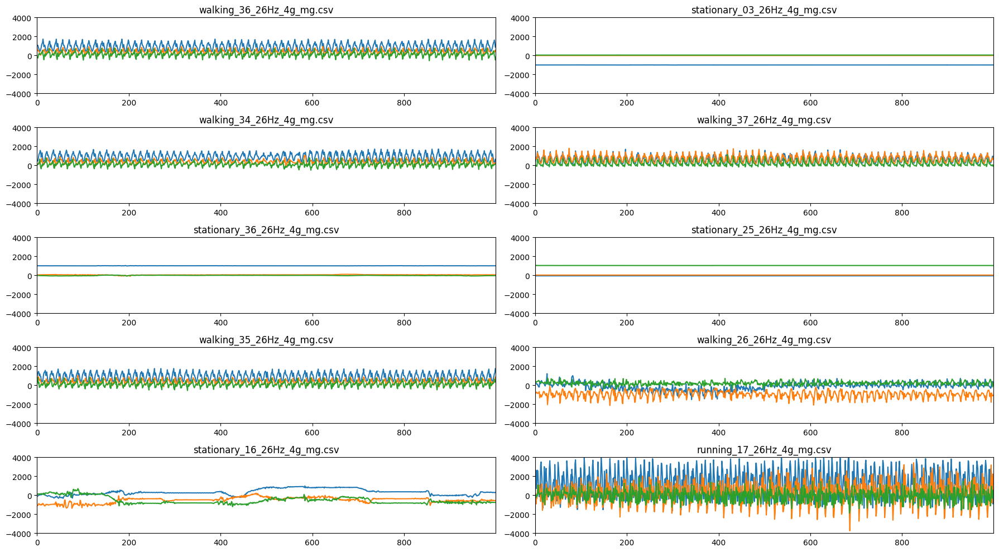
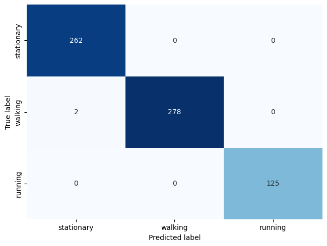

```python
#   This software component is licensed by ST under BSD-3-Clause license,
#   the "License"; You may not use this file except in compliance with the
#   License. You may obtain a copy of the License at:
#             https://opensource.org/licenses/BSD-3-Clause
```

[](https://colab.research.google.com/github/STMicroelectronics/stm32ai/blob/master/AI_resources/HAR/Human_Activity_Recognition.ipynb)

# Human Activity Recognition

This notebook shows the process of creating a basic motion sensing activity classifier model, using Keras, for STM32 embedded applications.


## Import TensorFlow

Use TensorFlow 2.5.0 to be aligned with X-CUBE-AI v7.0.0.


```python
import tensorflow as tf
print(tf.version.VERSION)
```

    2.19.0


## Loading the dataset

The dataset is composed of 3-axis acceleration values stored in `.csv` text format. Each individual file corresponds to a capture characterised by it's containing folder name.

Download and extract the dataset:


```python
!wget -nc https://github.com/STMicroelectronics/stm32ai/raw/master/AI_resources/HAR/dataset.zip
```

    File ‘dataset.zip’ already there; not retrieving.
    


```python
!unzip -n dataset.zip
```

    Archive:  dataset.zip
       creating: dataset/
      inflating: dataset/LICENSE         
      inflating: dataset/README.md       
       creating: dataset/running/
      inflating: dataset/running/running_01_26Hz_4g_mg.csv  
      inflating: dataset/running/running_02_26Hz_4g_mg.csv  
      inflating: dataset/running/running_03_26Hz_4g_mg.csv  
      inflating: dataset/running/running_04_26Hz_4g_mg.csv  
      inflating: dataset/running/running_05_26Hz_4g_mg.csv  
      inflating: dataset/running/running_06_26Hz_4g_mg.csv  
      inflating: dataset/running/running_07_26Hz_4g_mg.csv  
      inflating: dataset/running/running_08_26Hz_4g_mg.csv  
      inflating: dataset/running/running_09_26Hz_4g_mg.csv  
      inflating: dataset/running/running_10_26Hz_4g_mg.csv  
      inflating: dataset/running/running_12_26Hz_4g_mg.csv  
      inflating: dataset/running/running_13_26Hz_4g_mg.csv  
      inflating: dataset/running/running_14_26Hz_4g_mg.csv  
      inflating: dataset/running/running_15_26Hz_4g_mg.csv  
      inflating: dataset/running/running_16_26Hz_4g_mg.csv  
      inflating: dataset/running/running_17_26Hz_4g_mg.csv  
      inflating: dataset/running/running_18_26Hz_4g_mg.csv  
       creating: dataset/stationary/
      inflating: dataset/stationary/stationary_01_26Hz_4g_mg.csv  
      inflating: dataset/stationary/stationary_02_26Hz_4g_mg.csv  
      inflating: dataset/stationary/stationary_03_26Hz_4g_mg.csv  
      inflating: dataset/stationary/stationary_04_26Hz_4g_mg.csv  
      inflating: dataset/stationary/stationary_05_26Hz_4g_mg.csv  
      inflating: dataset/stationary/stationary_06_26Hz_4g_mg.csv  
      inflating: dataset/stationary/stationary_07_26Hz_4g_mg.csv  
      inflating: dataset/stationary/stationary_08_26Hz_4g_mg.csv  
      inflating: dataset/stationary/stationary_09_26Hz_4g_mg.csv  
      inflating: dataset/stationary/stationary_10_26Hz_4g_mg.csv  
      inflating: dataset/stationary/stationary_11_26Hz_4g_mg.csv  
      inflating: dataset/stationary/stationary_12_26Hz_4g_mg.csv  
      inflating: dataset/stationary/stationary_13_26Hz_4g_mg.csv  
      inflating: dataset/stationary/stationary_14_26Hz_4g_mg.csv  
      inflating: dataset/stationary/stationary_15_26Hz_4g_mg.csv  
      inflating: dataset/stationary/stationary_16_26Hz_4g_mg.csv  
      inflating: dataset/stationary/stationary_17_26Hz_4g_mg.csv  
      inflating: dataset/stationary/stationary_18_26Hz_4g_mg.csv  
      inflating: dataset/stationary/stationary_19_26Hz_4g_mg.csv  
      inflating: dataset/stationary/stationary_20_26Hz_4g_mg.csv  
      inflating: dataset/stationary/stationary_21_26Hz_4g_mg.csv  
      inflating: dataset/stationary/stationary_22_26Hz_4g_mg.csv  
      inflating: dataset/stationary/stationary_23_26Hz_4g_mg.csv  
      inflating: dataset/stationary/stationary_24_26Hz_4g_mg.csv  
      inflating: dataset/stationary/stationary_25_26Hz_4g_mg.csv  
      inflating: dataset/stationary/stationary_26_26Hz_4g_mg.csv  
      inflating: dataset/stationary/stationary_27_26Hz_4g_mg.csv  
      inflating: dataset/stationary/stationary_28_26Hz_4g_mg.csv  
      inflating: dataset/stationary/stationary_29_26Hz_4g_mg.csv  
      inflating: dataset/stationary/stationary_30_26Hz_4g_mg.csv  
      inflating: dataset/stationary/stationary_31_26Hz_4g_mg.csv  
      inflating: dataset/stationary/stationary_32_26Hz_4g_mg.csv  
      inflating: dataset/stationary/stationary_33_26Hz_4g_mg.csv  
      inflating: dataset/stationary/stationary_34_26Hz_4g_mg.csv  
      inflating: dataset/stationary/stationary_35_26Hz_4g_mg.csv  
      inflating: dataset/stationary/stationary_36_26Hz_4g_mg.csv  
       creating: dataset/walking/
      inflating: dataset/walking/walking_01_26Hz_4g_mg.csv  
      inflating: dataset/walking/walking_02_26Hz_4g_mg.csv  
      inflating: dataset/walking/walking_03_26Hz_4g_mg.csv  
      inflating: dataset/walking/walking_04_26Hz_4g_mg.csv  
      inflating: dataset/walking/walking_05_26Hz_4g_mg.csv  
      inflating: dataset/walking/walking_06_26Hz_4g_mg.csv  
      inflating: dataset/walking/walking_07_26Hz_4g_mg.csv  
      inflating: dataset/walking/walking_08_26Hz_4g_mg.csv  
      inflating: dataset/walking/walking_09_26Hz_4g_mg.csv  
      inflating: dataset/walking/walking_10_26Hz_4g_mg.csv  
      inflating: dataset/walking/walking_11_26Hz_4g_mg.csv  
      inflating: dataset/walking/walking_12_26Hz_4g_mg.csv  
      inflating: dataset/walking/walking_13_26Hz_4g_mg.csv  
      inflating: dataset/walking/walking_14_26Hz_4g_mg.csv  
      inflating: dataset/walking/walking_15_26Hz_4g_mg.csv  
      inflating: dataset/walking/walking_16_26Hz_4g_mg.csv  
      inflating: dataset/walking/walking_17_26Hz_4g_mg.csv  
      inflating: dataset/walking/walking_18_26Hz_4g_mg.csv  
      inflating: dataset/walking/walking_19_26Hz_4g_mg.csv  
      inflating: dataset/walking/walking_20_26Hz_4g_mg.csv  
      inflating: dataset/walking/walking_21_26Hz_4g_mg.csv  
      inflating: dataset/walking/walking_22_26Hz_4g_mg.csv  
      inflating: dataset/walking/walking_23_26Hz_4g_mg.csv  
      inflating: dataset/walking/walking_24_26Hz_4g_mg.csv  
      inflating: dataset/walking/walking_25_26Hz_4g_mg.csv  
      inflating: dataset/walking/walking_26_26Hz_4g_mg.csv  
      inflating: dataset/walking/walking_27_26Hz_4g_mg.csv  
      inflating: dataset/walking/walking_28_26Hz_4g_mg.csv  
      inflating: dataset/walking/walking_29_26Hz_4g_mg.csv  
      inflating: dataset/walking/walking_30_26Hz_4g_mg.csv  
      inflating: dataset/walking/walking_31_26Hz_4g_mg.csv  
      inflating: dataset/walking/walking_32_26Hz_4g_mg.csv  
      inflating: dataset/walking/walking_33_26Hz_4g_mg.csv  
      inflating: dataset/walking/walking_34_26Hz_4g_mg.csv  
      inflating: dataset/walking/walking_35_26Hz_4g_mg.csv  
      inflating: dataset/walking/walking_36_26Hz_4g_mg.csv  
      inflating: dataset/walking/walking_37_26Hz_4g_mg.csv  
      inflating: dataset/walking/walking_38_26Hz_4g_mg.csv  
      inflating: dataset/walking/walking_39_26Hz_4g_mg.csv  


Load the dataset into memory:


```python
import glob
import numpy as np

# Load data into memory
labels = ['stationary', 'walking', 'running']
x_recordings = []
y_recordings = []
recordings_filenames = []
for i, label in enumerate(labels):
    filenames = glob.glob('dataset/' + label + '/*.csv')
    for filename in filenames:
        data = np.loadtxt(filename, delimiter=',')
        x_recordings.append(data)
        y_recordings.append(i)
        recordings_filenames.append(filename)

x_recordings = np.array(x_recordings).reshape(len(x_recordings), -1, 3)
y_recordings = np.array(y_recordings)

print(x_recordings.shape)
print(y_recordings.shape)
```

    (92, 1000, 3)
    (92,)


## Exploring the dataset
To verify that the dataset has been loaded correctly, let's display and plot a few captures at random.


```python
import random
import matplotlib.pyplot as plt
%matplotlib inline

# Plot some captures
random.seed(10)
unique_rands = random.sample(range(len(x_recordings)), 10)
plt.figure(figsize=(18, 10))
for i, n in enumerate(unique_rands):
    plt.subplot(5, 2, i + 1)
    plt.margins(x=0, y=-0.25)
    plt.plot(x_recordings[n])
    plt.ylim(-4000, 4000)  # 4000 mg acc. range
    plt.title(recordings_filenames[n].split('/')[-1])
plt.tight_layout()
plt.show()
```


    

    


## Frame data

Each capture is framed into smaller windows. The window size will be the input dimension for the neural network. Optional overlapping can be added to further increase the number of points in our data for training and testing.

Here we are dividing the dataset into 1 second frames (26 samples at 26 Hz):


```python
import numpy as np

def frame(x, frame_len, hop_len):
    '''Slice a 3D data array into (overlapping) frames.
    
    Example
    --------
    >>> x = np.array([[0, 1, 2],
                      [10, 11, 12],
                      [20, 21, 22],
                      [30, 31, 32],
                      [40, 41, 42],
                      [50, 51, 52],
                      [60, 61, 62]])
    >>> frames = x.frame(x, 3, 2)
    >>> x.shape
    (7, 3)
    >>> frames.shape
    (3, 3, 3)
    '''

    assert(x.shape == (len(x), 3))
    assert(x.shape[0] >= frame_len)
    assert(hop_len >= 1)

    n_frames = 1 + (x.shape[0] - frame_len) // hop_len
    shape = (n_frames, frame_len, x.shape[1])
    strides = ((hop_len * x.strides[0],) + x.strides)
    return np.lib.stride_tricks.as_strided(x, shape=shape, strides=strides)

x_frames = []
y_frames = []
for i in range(x_recordings.shape[0]):
    # frames = frame(x_recordings[i], 26, 26) # no overlap
    frames = frame(x_recordings[i], 260, 26) # 10 second frame, 1 second overlap -> 10 % overlap 
    x_frames.append(frames)
    y_frames.append(np.full(frames.shape[0], y_recordings[i]))

print(np.array(x_frames).shape)
x_frames = np.concatenate(x_frames)
y_frames = np.concatenate(y_frames)
print(x_frames.shape)

# Each output label is an integer between 0 and 2:
print(y_frames.shape)
print(labels)
```

    (92, 29, 260, 3)
    (2668, 260, 3)
    (2668,)
    ['stationary', 'walking', 'running']


## Preprocessing the dataset

To improve the model's performance, it is recommended to perform some kind of pre-processing on the input data before feeding them to the neural network model. Data pre-processing can include filtering, gravity rotation and/or suppression as it is done in [FP-AI-SENSING1]. In this example, a simple data scaling will suffice.

Data scaling can be achieved by normalizing or standardizing input data. In this example, data is normalized into floating point values between `-1.0` and `1.0` by dividing them by the sensor's full range (`4000 mg`).

[FP-AI-SENSING1]:https://www.st.com/en/embedded-software/fp-ai-sensing1.html


```python
# Normalize input data between [-1;1]
x_frames_normed = x_frames / 4000
```

### Preparing the dataset (train, test, split)
The dataset is split into a _train_ and _test_ set. The data is first shuffled and then split with 25% reserved for model evaluation and testing purposes.


```python
from sklearn.model_selection import train_test_split

x_train, x_test, y_train, y_test = train_test_split(
    x_frames_normed, y_frames, test_size=0.25)

print("Trainning samples:", x_train.shape)
print("Testing samples:", x_test.shape)
print(x_train.shape)           # Should be (num_samples, 260, 3)
print(x_train[0].shape)        # Should be (260, 3) 
```

    Trainning samples: (2001, 260, 3)
    Testing samples: (667, 260, 3)
    (2001, 260, 3)
    (260, 3)


## Creating the model

Let's create a classifier model using Keras.

Build the tf.keras.Sequential model by stacking layers. Choose an optimizer and loss function for training:


```python
## Conv1D based model
model = tf.keras.models.Sequential([
  tf.keras.layers.Conv1D(filters=16, kernel_size=3, activation='relu', input_shape=(260, 3)), #input adjusted
  tf.keras.layers.Conv1D(filters=8, kernel_size=3, activation='relu'),
  tf.keras.layers.Dropout(0.5),
  tf.keras.layers.Flatten(),
  tf.keras.layers.Dense(64, activation='relu'),
  tf.keras.layers.Dense(3, activation='softmax')
])
model.compile(optimizer='adam',
              loss='sparse_categorical_crossentropy',
              metrics=['accuracy'])
model.fit(x_train, y_train, epochs=30)
test_loss, test_acc = model.evaluate(x_test,  y_test, verbose=2)

print("Test loss:", test_loss)
print("Test acc:", test_acc)
model.summary()
```

    Epoch 1/30


    /home/chris/human-activity-recognition/.venv/lib/python3.10/site-packages/keras/src/layers/convolutional/base_conv.py:113: UserWarning: Do not pass an `input_shape`/`input_dim` argument to a layer. When using Sequential models, prefer using an `Input(shape)` object as the first layer in the model instead.
      super().__init__(activity_regularizer=activity_regularizer, **kwargs)


    63/63 ━━━━━━━━━━━━━━━━━━━━ 1s 6ms/step - accuracy: 0.5315 - loss: 0.8643
    Epoch 2/30
    63/63 ━━━━━━━━━━━━━━━━━━━━ 0s 6ms/step - accuracy: 0.8517 - loss: 0.3402
    Epoch 3/30
    63/63 ━━━━━━━━━━━━━━━━━━━━ 0s 6ms/step - accuracy: 0.9427 - loss: 0.1764
    Epoch 4/30
    63/63 ━━━━━━━━━━━━━━━━━━━━ 0s 6ms/step - accuracy: 0.9717 - loss: 0.1074
    Epoch 5/30
    63/63 ━━━━━━━━━━━━━━━━━━━━ 0s 6ms/step - accuracy: 0.9863 - loss: 0.0576
    Epoch 6/30
    63/63 ━━━━━━━━━━━━━━━━━━━━ 0s 6ms/step - accuracy: 0.9712 - loss: 0.0760
    Epoch 7/30
    63/63 ━━━━━━━━━━━━━━━━━━━━ 0s 6ms/step - accuracy: 0.9784 - loss: 0.0709
    Epoch 8/30
    63/63 ━━━━━━━━━━━━━━━━━━━━ 0s 6ms/step - accuracy: 0.9784 - loss: 0.0619
    Epoch 9/30
    63/63 ━━━━━━━━━━━━━━━━━━━━ 0s 6ms/step - accuracy: 0.9874 - loss: 0.0365
    Epoch 10/30
    63/63 ━━━━━━━━━━━━━━━━━━━━ 0s 6ms/step - accuracy: 0.9883 - loss: 0.0425
    Epoch 11/30
    63/63 ━━━━━━━━━━━━━━━━━━━━ 0s 6ms/step - accuracy: 0.9862 - loss: 0.0330
    Epoch 12/30
    63/63 ━━━━━━━━━━━━━━━━━━━━ 0s 6ms/step - accuracy: 0.9937 - loss: 0.0208
    Epoch 13/30
    63/63 ━━━━━━━━━━━━━━━━━━━━ 0s 6ms/step - accuracy: 0.9922 - loss: 0.0259
    Epoch 14/30
    63/63 ━━━━━━━━━━━━━━━━━━━━ 0s 6ms/step - accuracy: 0.9939 - loss: 0.0196
    Epoch 15/30
    63/63 ━━━━━━━━━━━━━━━━━━━━ 0s 6ms/step - accuracy: 0.9885 - loss: 0.0323
    Epoch 16/30
    63/63 ━━━━━━━━━━━━━━━━━━━━ 0s 6ms/step - accuracy: 0.9926 - loss: 0.0206
    Epoch 17/30
    63/63 ━━━━━━━━━━━━━━━━━━━━ 0s 6ms/step - accuracy: 0.9888 - loss: 0.0262
    Epoch 18/30
    63/63 ━━━━━━━━━━━━━━━━━━━━ 0s 6ms/step - accuracy: 0.9878 - loss: 0.0324
    Epoch 19/30
    63/63 ━━━━━━━━━━━━━━━━━━━━ 0s 6ms/step - accuracy: 0.9923 - loss: 0.0281
    Epoch 20/30
    63/63 ━━━━━━━━━━━━━━━━━━━━ 0s 6ms/step - accuracy: 0.9858 - loss: 0.0362
    Epoch 21/30
    63/63 ━━━━━━━━━━━━━━━━━━━━ 0s 6ms/step - accuracy: 0.9874 - loss: 0.0492
    Epoch 22/30
    63/63 ━━━━━━━━━━━━━━━━━━━━ 0s 7ms/step - accuracy: 0.9991 - loss: 0.0124
    Epoch 23/30
    63/63 ━━━━━━━━━━━━━━━━━━━━ 0s 6ms/step - accuracy: 0.9943 - loss: 0.0143
    Epoch 24/30
    63/63 ━━━━━━━━━━━━━━━━━━━━ 0s 6ms/step - accuracy: 0.9951 - loss: 0.0106
    Epoch 25/30
    63/63 ━━━━━━━━━━━━━━━━━━━━ 0s 6ms/step - accuracy: 0.9956 - loss: 0.0123
    Epoch 26/30
    63/63 ━━━━━━━━━━━━━━━━━━━━ 0s 6ms/step - accuracy: 0.9943 - loss: 0.0149
    Epoch 27/30
    63/63 ━━━━━━━━━━━━━━━━━━━━ 0s 6ms/step - accuracy: 0.9971 - loss: 0.0108
    Epoch 28/30
    63/63 ━━━━━━━━━━━━━━━━━━━━ 0s 6ms/step - accuracy: 0.9967 - loss: 0.0088
    Epoch 29/30
    63/63 ━━━━━━━━━━━━━━━━━━━━ 0s 6ms/step - accuracy: 0.9967 - loss: 0.0103
    Epoch 30/30
    63/63 ━━━━━━━━━━━━━━━━━━━━ 0s 6ms/step - accuracy: 0.9957 - loss: 0.0110
    21/21 - 0s - 11ms/step - accuracy: 0.9970 - loss: 0.0105
    Test loss: 0.010520135052502155
    Test acc: 0.9970015287399292


<pre style="white-space:pre;overflow-x:auto;line-height:normal;font-family:Menlo,'DejaVu Sans Mono',consolas,'Courier New',monospace"><span style="font-weight: bold">Model: "sequential_5"</span>
</pre>


<pre style="white-space:pre;overflow-x:auto;line-height:normal;font-family:Menlo,'DejaVu Sans Mono',consolas,'Courier New',monospace">┏━━━━━━━━━━━━━━━━━━━━━━━━━━━━━━━━━┳━━━━━━━━━━━━━━━━━━━━━━━━┳━━━━━━━━━━━━━━━┓
┃<span style="font-weight: bold"> Layer (type)                    </span>┃<span style="font-weight: bold"> Output Shape           </span>┃<span style="font-weight: bold">       Param # </span>┃
┡━━━━━━━━━━━━━━━━━━━━━━━━━━━━━━━━━╇━━━━━━━━━━━━━━━━━━━━━━━━╇━━━━━━━━━━━━━━━┩
│ conv1d_10 (<span style="color: #0087ff; text-decoration-color: #0087ff">Conv1D</span>)              │ (<span style="color: #00d7ff; text-decoration-color: #00d7ff">None</span>, <span style="color: #00af00; text-decoration-color: #00af00">258</span>, <span style="color: #00af00; text-decoration-color: #00af00">16</span>)        │           <span style="color: #00af00; text-decoration-color: #00af00">160</span> │
├─────────────────────────────────┼────────────────────────┼───────────────┤
│ conv1d_11 (<span style="color: #0087ff; text-decoration-color: #0087ff">Conv1D</span>)              │ (<span style="color: #00d7ff; text-decoration-color: #00d7ff">None</span>, <span style="color: #00af00; text-decoration-color: #00af00">256</span>, <span style="color: #00af00; text-decoration-color: #00af00">8</span>)         │           <span style="color: #00af00; text-decoration-color: #00af00">392</span> │
├─────────────────────────────────┼────────────────────────┼───────────────┤
│ dropout_5 (<span style="color: #0087ff; text-decoration-color: #0087ff">Dropout</span>)             │ (<span style="color: #00d7ff; text-decoration-color: #00d7ff">None</span>, <span style="color: #00af00; text-decoration-color: #00af00">256</span>, <span style="color: #00af00; text-decoration-color: #00af00">8</span>)         │             <span style="color: #00af00; text-decoration-color: #00af00">0</span> │
├─────────────────────────────────┼────────────────────────┼───────────────┤
│ flatten_5 (<span style="color: #0087ff; text-decoration-color: #0087ff">Flatten</span>)             │ (<span style="color: #00d7ff; text-decoration-color: #00d7ff">None</span>, <span style="color: #00af00; text-decoration-color: #00af00">2048</span>)           │             <span style="color: #00af00; text-decoration-color: #00af00">0</span> │
├─────────────────────────────────┼────────────────────────┼───────────────┤
│ dense_10 (<span style="color: #0087ff; text-decoration-color: #0087ff">Dense</span>)                │ (<span style="color: #00d7ff; text-decoration-color: #00d7ff">None</span>, <span style="color: #00af00; text-decoration-color: #00af00">64</span>)             │       <span style="color: #00af00; text-decoration-color: #00af00">131,136</span> │
├─────────────────────────────────┼────────────────────────┼───────────────┤
│ dense_11 (<span style="color: #0087ff; text-decoration-color: #0087ff">Dense</span>)                │ (<span style="color: #00d7ff; text-decoration-color: #00d7ff">None</span>, <span style="color: #00af00; text-decoration-color: #00af00">3</span>)              │           <span style="color: #00af00; text-decoration-color: #00af00">195</span> │
└─────────────────────────────────┴────────────────────────┴───────────────┘
</pre>


<pre style="white-space:pre;overflow-x:auto;line-height:normal;font-family:Menlo,'DejaVu Sans Mono',consolas,'Courier New',monospace"><span style="font-weight: bold"> Total params: </span><span style="color: #00af00; text-decoration-color: #00af00">395,651</span> (1.51 MB)
</pre>


<pre style="white-space:pre;overflow-x:auto;line-height:normal;font-family:Menlo,'DejaVu Sans Mono',consolas,'Courier New',monospace"><span style="font-weight: bold"> Trainable params: </span><span style="color: #00af00; text-decoration-color: #00af00">131,883</span> (515.17 KB)
</pre>


<pre style="white-space:pre;overflow-x:auto;line-height:normal;font-family:Menlo,'DejaVu Sans Mono',consolas,'Courier New',monospace"><span style="font-weight: bold"> Non-trainable params: </span><span style="color: #00af00; text-decoration-color: #00af00">0</span> (0.00 B)
</pre>


<pre style="white-space:pre;overflow-x:auto;line-height:normal;font-family:Menlo,'DejaVu Sans Mono',consolas,'Courier New',monospace"><span style="font-weight: bold"> Optimizer params: </span><span style="color: #00af00; text-decoration-color: #00af00">263,768</span> (1.01 MB)
</pre>


```python
import matplotlib.pyplot as plt
import seaborn as sns
%matplotlib inline

Y_pred = model.predict(x_test)
y_pred = np.argmax(Y_pred, axis=1)
confusion_matrix = tf.math.confusion_matrix(y_test, y_pred)

plt.figure()
sns.heatmap(confusion_matrix,
            annot=True,
            xticklabels=labels,
            yticklabels=labels,
            cmap=plt.cm.Blues,
            fmt='d', cbar=False)
plt.tight_layout()
plt.ylabel('True label')
plt.xlabel('Predicted label')
plt.show()
print("Unique y_test labels:", np.unique(y_test))
print("Labels list:", labels)
```

    21/21 ━━━━━━━━━━━━━━━━━━━━ 0s 5ms/step


    

    


    Unique y_test labels: [0 1 2]
    Labels list: ['stationary', 'walking', 'running']


```python
converter = tf.lite.TFLiteConverter.from_keras_model(model)
tflite_model = converter.convert()

with open('model.tflite', 'wb') as f:
    f.write(tflite_model)
```

    INFO:tensorflow:Assets written to: /tmp/tmpw0y9tb5s/assets


    INFO:tensorflow:Assets written to: /tmp/tmpw0y9tb5s/assets


    Saved artifact at '/tmp/tmpw0y9tb5s'. The following endpoints are available:
    
    * Endpoint 'serve'
      args_0 (POSITIONAL_ONLY): TensorSpec(shape=(None, 260, 3), dtype=tf.float32, name='keras_tensor_56')
    Output Type:
      TensorSpec(shape=(None, 3), dtype=tf.float32, name=None)
    Captures:
      139652799149536: TensorSpec(shape=(), dtype=tf.resource, name=None)
      139652272761744: TensorSpec(shape=(), dtype=tf.resource, name=None)
      139652272763152: TensorSpec(shape=(), dtype=tf.resource, name=None)
      139652272765616: TensorSpec(shape=(), dtype=tf.resource, name=None)
      139652272765792: TensorSpec(shape=(), dtype=tf.resource, name=None)
      139652273196368: TensorSpec(shape=(), dtype=tf.resource, name=None)
      139652272765968: TensorSpec(shape=(), dtype=tf.resource, name=None)
      139652273197952: TensorSpec(shape=(), dtype=tf.resource, name=None)


    W0000 00:00:1753361483.628705  133671 tf_tfl_flatbuffer_helpers.cc:365] Ignored output_format.
    W0000 00:00:1753361483.628731  133671 tf_tfl_flatbuffer_helpers.cc:368] Ignored drop_control_dependency.
    2025-07-24 14:51:23.629089: I tensorflow/cc/saved_model/reader.cc:83] Reading SavedModel from: /tmp/tmpw0y9tb5s
    2025-07-24 14:51:23.630218: I tensorflow/cc/saved_model/reader.cc:52] Reading meta graph with tags { serve }
    2025-07-24 14:51:23.630235: I tensorflow/cc/saved_model/reader.cc:147] Reading SavedModel debug info (if present) from: /tmp/tmpw0y9tb5s
    2025-07-24 14:51:23.637062: I tensorflow/cc/saved_model/loader.cc:236] Restoring SavedModel bundle.
    2025-07-24 14:51:23.676576: I tensorflow/cc/saved_model/loader.cc:220] Running initialization op on SavedModel bundle at path: /tmp/tmpw0y9tb5s
    2025-07-24 14:51:23.687567: I tensorflow/cc/saved_model/loader.cc:471] SavedModel load for tags { serve }; Status: success: OK. Took 58485 microseconds.

